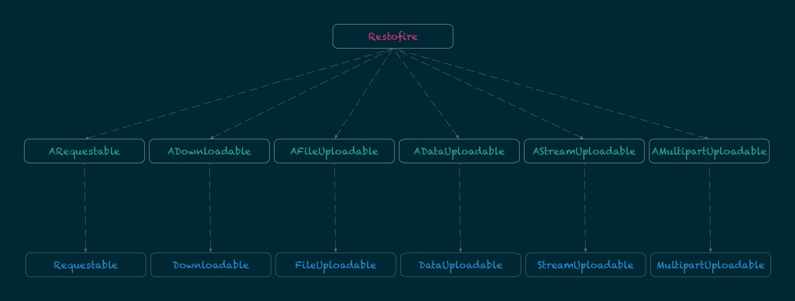

## Restofire

[](https://cocoapods.org/pods/Restofire)
[](https://raw.githubusercontent.com/Restofire/Restofire/master/LICENSE)

[](https://github.com/apple/swift-package-manager)
[](https://github.com/Carthage/Carthage)
[](https://cocoapods.org/pods/Restofire)

[](https://travis-ci.org/Restofire/Restofire/branches)

[](https://gitter.im/Restofire/Restofire?utm_source=badge&utm_medium=badge&utm_campaign=pr-badge&utm_content=badge)
[](https://twitter.com/rahulkatariya91)

Restofire is a protocol oriented network abstraction layer in swift that is built on top of [Alamofire](https://github.com/Alamofire/Alamofire) to use services in a declartive way.

- [Features](#features)
- [Requirements](#requirements)
- [Installation](#installation)
- [Architecture](#architecture)
- [Configurations](#configurations)
- [Usage](#usage)
- [License](#license)

## Features

- [x] No Learning Curve
- [x] Default Configuration for Base URL / headers / parameters etc
- [x] Multiple Configurations
- [x] Single Request Configuration
- [x] Custom Response Serializers like JSONDecodable
- [x] Authentication
- [x] Response Validations
- [x] AutoRetry based on URLError codes
- [x] NSOperations
- [x] Request eventually when internet is reachable
- [x] [Complete Documentation](http://restofire.github.io/Restofire/)

## Requirements

- iOS 8.0+ / Mac OS X 10.10+ / tvOS 9.0+ / watchOS 2.0+
- Xcode 9
- Swift 4

## Installation

### CocoaPods

[CocoaPods](http://cocoapods.org) is a dependency manager for Cocoa projects. You can install it with the following command:

```bash
$ gem install cocoapods
```

To integrate Restofire into your Xcode project using CocoaPods, specify it in your `Podfile`:

```ruby
source 'https://github.com/CocoaPods/Specs.git'
platform :ios, '8.0'
use_frameworks!

pod 'Restofire', '~> 3.0.0'
```

Then, run the following command:

```bash
$ pod install
```

### Carthage

[Carthage](https://github.com/Carthage/Carthage) is a decentralized dependency manager that automates the process of adding frameworks to your Cocoa application.

You can install Carthage with [Homebrew](http://brew.sh/) using the following command:

```bash
$ brew update
$ brew install carthage
```

To integrate Restofire into your Xcode project using Carthage, specify it in your `Cartfile`:

```ogdl
github "Restofire/Restofire" ~> 3.0.0
```
### Swift Package Manager

To use Restofire as a [Swift Package Manager](https://swift.org/package-manager/) package just add the following in your Package.swift file.

``` swift
import PackageDescription

let package = Package(
    name: "HelloRestofire",
    dependencies: [
        .Package(url: "https://github.com/Restofire/Restofire.git", .upToNextMajor(from: "3.0.0"))
    ]
)
```

### Manually

If you prefer not to use either of the aforementioned dependency managers, you can integrate Restofire into your project manually.

#### Git Submodules

- Open up Terminal, `cd` into your top-level project directory, and run the following command "if" your project is not initialized as a git repository:

```bash
$ git init
```

- Add Restofire as a git [submodule](http://git-scm.com/docs/git-submodule) by running the following command:

```bash
$ git submodule add https://github.com/Restofire/Restofire.git
$ git submodule update --init --recursive
```

- Open the new `Restofire` folder, and drag the `Restofire.xcodeproj` into the Project Navigator of your application's Xcode project.

    > It should appear nested underneath your application's blue project icon. Whether it is above or below all the other Xcode groups does not matter.

- Select the `Restofire.xcodeproj` in the Project Navigator and verify the deployment target matches that of your application target.
- Next, select your application project in the Project Navigator (blue project icon) to navigate to the target configuration window and select the application target under the "Targets" heading in the sidebar.
- In the tab bar at the top of that window, open the "General" panel.
- Click on the `+` button under the "Embedded Binaries" section.
- You will see two different `Restofire.xcodeproj` folders each with two different versions of the `Restofire.framework` nested inside a `Products` folder.

    > It does not matter which `Products` folder you choose from.

- Select the `Restofire.framework` & `Alamofire.framework`.

- And that's it!

> The `Restofire.framework` is automagically added as a target dependency, linked framework and embedded framework in a copy files build phase which is all you need to build on the simulator and a device.

#### Embeded Binaries

- Download the latest release from https://github.com/Restofire/Restofire/releases
- Next, select your application project in the Project Navigator (blue project icon) to navigate to the target configuration window and select the application target under the "Targets" heading in the sidebar.
- In the tab bar at the top of that window, open the "General" panel.
- Click on the `+` button under the "Embedded Binaries" section.
- Add the downloaded `Restofire.framework` & `Alamofire.framework`.
- And that's it!

---

## Architecture

### Two Layered Architecture



- **Alamofire Layer** — consists of protocols for Request, Download and Upload to construct the respective Alamofire.Request instance. All Alamofire Protocols have a prefix `A`.

- **Restofire Layer** — consists of protocols for Request, Download and Upload to construct the respective RequestOperation instance from the Alamofire.Request and support features like AutoRetry, WaitForConnectivity, Automatic ResponseSerialization from associatedType etc.

## Usage

### Configurations

#### Three levels of configuration

- **Global Configuration** – The global configuration will be applied to all the requests. These include values like scheme, host, version, headers, sessionManager, callbackQueue, maxRetryCount, waitsForConnectivity etc.

```swift
func application(application: UIApplication, didFinishLaunchingWithOptions launchOptions: [NSObject: AnyObject]?) -> Bool {

    Restofire.Configuration.default.host = "httpbin.org"
    Restofire.Retry.default.retryErrorCodes = [.requestTimedOut,.networkConnectionLost]

    return true
}
```

- **Group Configuration** – The group configuration inherits all the values from the global configuration. It can be used to group requests that have same behaviour but different from the global configuration. For instance, If you have more than one host or If your global configuration has default url session and some requests require you to use empharal URL session.

```swift
import Restofire

protocol NYConfigurable: Configurable {}

extension NYConfigurable {

    public var configuration: Configuration {
        var configuration = Restofire.Configuration.default
        configuration.scheme = "http://"
        configuration.host = "api.nytimes.com/svc/movies"
        configuration.version = "v2"
        return configuration
    }

}

protocol NYRequestable: Requestable, NYConfigurable {}
```

- **Per Request Configuration** – The request configuration inherits all the values from the group configuration or directly from the global configuration.

```swift
import Restofire

struct MoviesReviewGETService: NYRequestable {

    typealias Response = [MovieReview]
    var path: String?
    var parameters: Any?

    init(path: String, parameters: Any) {
        self.path += path
        self.parameters = parameters
    }

}
```

### Making a Request

#### Using the Completion Handler

`Requestable` gives you completion handler to enable making requests and receive response.

```swift
import Restofire

class ViewController: UITableViewController {

    var movieReviews: [MovieReview]!
    var requestOp: RequestOperation<MoviesReviewGETService>!

    func getReviews() {
        requestOp = MoviesReviewGETService(parameters: ["name": "Rahul Katariya"]).response() {
            if let value = $0.result.value {
                self.movieReviews = value
            }
        }
    }

    deinit {
        requestOp.cancel()
    }

}
```

#### Using the delegate methods

`Requestable` gives you delegate methods to enable making requests from anywhere which you can use to store data in your cache.

```swift
import Restofire

struct MoviesReviewGETService: NYRequestable {

    ...

    static func loadMoviews() {
      MoviesReviewGETService(parameters: ["name": "Rahul Katariya"])
    }

    func request(_ request: DataRequest, didCompleteWithValue value: [MovieReview]) {
      // Here you can store the results into your cache and then listen for changes inside your view controller.
    }

}
```

### Custom Response Serializers

#### Decodable

By adding the following snippet in your project, All `Requestable` associatedType Response as `Decodable` will be decoded with JSONDecoder.

```swift
import Restofire

extension Restofire.DataResponseSerializable where Response: Decodable {

    public var responseSerializer: DataResponseSerializer<Response> {
        return DataRequest.JSONDecodableResponseSerializer()
    }

}
```

#### JSON

By adding the following snippet in your project, All `Requestable` associatedType Response as `Any` will be decoded with NSJSONSerialization.

```swift
import Restofire

extension Restofire.DataResponseSerializable where Response == Any {

    public var responseSerializer: DataResponseSerializer<Response> {
        return DataRequest.jsonResponseSerializer()
    }

}
```

### Retry Request when Internet is Reachable

`Requestable` gives you a property waitsForConnectivity which you can set to true. This will make the first request. If the request fails, it will wait for internet to retry the request.

```swift
struct PushTokenPutService: Requestable {

    typealias Response = Data
    ...
    var waitsForConnectivity: Bool = true

}
```
# Contributing

Issues and pull requests are welcome!

# Author

Rahul Katariya [@rahulkatariya91](https://twitter.com/rahulkatariya91)

## License

Restofire is released under the MIT license. See [LICENSE](https://github.com/Restofire/Restofire/blob/master/LICENSE) for details.
